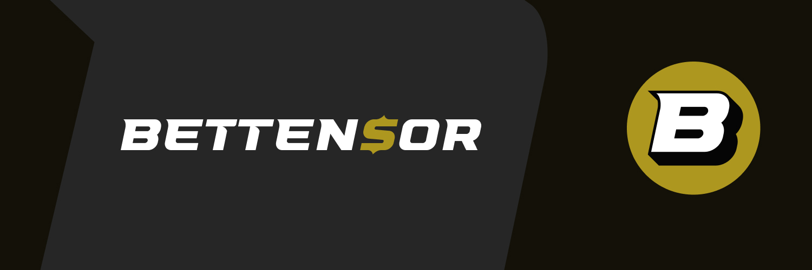

<div align="center">

 


A sports prediction subnet on the Bittensor network

[Installation](#installation-and-setup) • [Validators](#guide-for-validators) • [Miners](#guide-for-miners) • [Release Details](#details-for-current-release-version-v001-beta) • [Website](https://bettensor.com) • [Official Discord Server](https://discord.gg/YVyVHHEd) 

</div>

## What Is Bettensor?

Bettensor is a sports prediction subnet. The goal of Bettensor is to provide a platform for sports fans to predict the outcomes of their favorite sporting events, and ML/AI researchers to develop new models and strategies to benchmark against good, old fashioned human intelligence and intuition. 

Mining on this subnet is simple. In this Beta release, miners receive upcoming games and odds, submit predictions as a simulated wager, and are rewarded for correct predictions upon game conclusion. Compute requirements are minimal for those choosing the human intelligence method - all you need is to consistently submit predictions for upcoming games.


> [!IMPORTANT]
> **Before you begin using our services, please read this legal disclaimer carefully:**

>- **Nature of Service:** Bettensor is a software application developed on the Bittensor network, which operates independently of our control. We are not a financial institution, nor do we facilitate any monetary transactions directly. Bettensor does not distribute payments nor collects money, whether in the form of cryptocurrencies or fiat currencies.

>- **Rewards and Transactions:** Users of Bettensor engage directly with the Bittensor network. Rewards or payments are issued by the Bittensor network based on the protocols established within its framework. Bettensor's role is limited to providing software that suggests allocation of $TAO tokens based on the predictions made by users. We do not influence or control the decision-making process of the Bittensor network concerning the distribution of rewards.

>- **No Financial Advice:** The information provided by Bettensor is for informational purposes only and should not be considered financial advice. Users should conduct their own research or consult with a professional advisor before engaging in any betting activities.

>- **Assumption of Risk:** By using Bettensor, users acknowledge and accept the risks associated with online betting and digital transactions, including but not limited to the risk of financial loss. Users should engage with the platform responsibly and within the bounds of applicable laws and regulations.

>- **Compliance with Laws:** Users of Bettensor are solely responsible for ensuring that their actions comply with local, state, and federal laws applicable to sports betting and online gambling. Bettensor assumes no responsibility for illegal or unauthorized use of the service.

>- **Changes and Amendments:** We reserve the right to modify this disclaimer at any time. Users are encouraged to periodically review this document to stay informed of any changes.

>By using Bettensor, you acknowledge that you have read, understood, and agreed to the terms outlined in this legal disclaimer. If you do not agree with any part of this disclaimer, you should not use Bettensor.


## Installation and Setup

To mine or validate on this subnet, we recommend starting with a cheap VPS instance running Ubuntu 22.04. As with most Subnets, we also recommend running your own Lite Node. You can find a guide to running a Lite Node [here](https://docs.bittensor.com/subtensor-nodes/). 

>[!NOTE]
>In this current Beta version, we require Bittensor v6.9.3.

1. Clone the repository:
```bash
   git clone https://github.com/bettensor/bettensor.git
```

3. Update apt-get:
```bash
sudo apt-get update
```

3. Set up a virtual environment (Python 3.10 recommended):
```bash
   python3.10 -m venv venv
   source venv/bin/activate
```

4. Install dependencies:
```bash
   cd bettensor
   pip install -e .
   pip install -r requirements.txt
```

5. Install pm2 (recommended for process management):
```bash
sudo apt-get install -y npm jq
sudo npm install -g pm2
```

6. Set up a Bittensor wallet (guide [here](https://docs.bittensor.com/getting-started/wallets)).

7. Register on the subnet:

- Mainnet `(NETUID 30)`:

 ```bash
btcli subnet register --netuid 30 --wallet.name <YOUR_COLDKEY> --wallet.hotkey <YOUR_HOTKEY>
 ```
- Testnet `(NETUID: 181)`:

 ```bash
btcli subnet register --netuid 181 --wallet.name <YOUR_COLDKEY> --wallet.hotkey <YOUR_HOTKEY> --subtensor.network test
 ```


## Guide for Validators

1. Obtain API key(s) from [this games API](https://rapidapi.com/search/Sports) (currently using API-FOOTBALL and API-BASEBALL).

2. Create a `.env` file in the top-level directory:
   ```
   RAPID_API_KEY=<YOUR_API_KEY>
   ```

3. Create a new file `validator.sh` in the top-level directory. Copy the contents of `template-scripts/validator.sh.template` to this file. 
   ```bash
   cp template-scripts/validator.sh.template validator.sh
   ```


4. Edit the `NEURON_ARGS` variable to set the appropriate network and wallet details.
   - if you are running without a local node, remove the `--subtensor.chain_endpoint`  argument

5. Start the validator:
   ```bash
   pm2 start validator.sh  
   ```
   >[!NOTE]
   > If you would like to disable auto-updates from github, you will need to add the `--disable-auto-update` flag to the pm2 command. (not recommended).
   >
   >Additionally, you should NOT use the pm2 --name flag anymore, this will prevent auto updates from working.

6. Check logs for Success:
   ```bash
   pm2 logs validator
   ```
   >[!NOTE]
   > We recommend running with --logging.trace while we are in Beta. This is much more verbose, but it will help us to pinpoint and fix any issues more quickly.


## Guide for Miners

1. Create a new file `miner.sh` in the top-level directory. Copy the contents of `template-scripts/miner.sh.template` to this file. 
   ```bash
   cp template-scripts/miner.sh.template miner.sh
   ```

2. Edit the `NEURON_ARGS` variable to set the appropriate network and wallet details.
   - if you are running without a local node, remove the `--subtensor.chain_endpoint`  argument
   

3. Start the miner:
   ```bash
   pm2 start miner.sh 
   ```
   >[!NOTE]
   > If you would like to disable auto-updates from github, you will need to add the `--disable-auto-update` flag to the pm2 command. (not recommended for "manual" miners)
   > Additionally, if you are running multiple miners, you'll need to have multiple copies of the `miner.sh` file, each with a unique name, (like miner1,miner2,etc) and run each one with `pm2 start <script-name>`.
   >You should NOT use the name flag anymore, this will prevent auto updates from working.

4. Check logs for Success and wait for some game data:
   ```bash
   pm2 logs miner
   ```

5. Submit predictions with our Beta User Interface:
   ```bash
   python bettensor/miner/cli.py
   ```
6. If you're running more than one miner, you can specify with the `--uid` flag. (this is your network UID for the miner). You can reference `./data/miner_env.txt` to find your NETUIDs
    ```bash
    python bettensor/miner/cli.py --uid <UID>
    ```

   >[!NOTE]
   > We recommend running with --logging.trace while we are in Beta. This is much more verbose, but it will help us to pinpoint and fix any issues more quickly.


## Incentive Mechanism and Scoring
- In the current version, our scoring system is quite simple. 
- Miners get a simulated daily balance of $1000 which is reset daily at 00:00 UTC. 
- They can select games to predict on by placing a **simulated** moneyline wager. 
- Odds for the wager are updated frequently from sportsbook APIs, and recorded by the validator upon submission of a prediction.
- When a game concludes, the outcome of the simulated wager is calculated with the Odds that were recorded on submission. The miner, if they won, then recieves an "earnings balance" equal to the simulated wager amount multiplied by the Odds of their prediction at time of submission.
- Losses don't count against the earnings balance. Only wins affect it.
- Validators score miners on a rolling 2-day period of earnings. Reward is linearly proportional to earnings.

With this design, we heavily incentivize correct predictions. Danger of deregistration is high with just one bad day of predictions. Potential of earning high rewards is there too, if you know something other people don't.


## Details for Current Release Version (v0.0.2, Beta)

>[!CAUTION]
>This is a Beta release of BetTensor. We expect instability and frequent updates. Please contact us on discord if you have any issues or suggestions.

- Model-based predictions are not integrated in this version. 
- Currently supported sports: MLB, MLS
- Requires Bittensor==v6.9.3. Support for Bittensor v7.x is coming soon.


## License

This repository is licensed under the MIT License.

```text
The MIT License (MIT)
Copyright © 2024 Bettensor (oneandahalfcats, geardici, honeybadgerhavoc)

# Permission is hereby granted, free of charge, to any person obtaining a copy of this software and associated
# documentation files (the "Software"), to deal in the Software without restriction, including without limitation
# the rights to use, copy, modify, merge, publish, distribute, sublicense, and/or sell copies of the Software,
# and to permit persons to whom the Software is furnished to do so, subject to the following conditions:

# The above copyright notice and this permission notice shall be included in all copies or substantial portions of
# the Software.

# THE SOFTWARE IS PROVIDED "AS IS", WITHOUT WARRANTY OF ANY KIND, EXPRESS OR IMPLIED, INCLUDING BUT NOT LIMITED TO
# THE WARRANTIES OF MERCHANTABILITY, FITNESS FOR A PARTICULAR PURPOSE AND NONINFRINGEMENT. IN NO EVENT SHALL
# THE AUTHORS OR COPYRIGHT HOLDERS BE LIABLE FOR ANY CLAIM, DAMAGES OR OTHER LIABILITY, WHETHER IN AN ACTION
# OF CONTRACT, TORT OR OTHERWISE, ARISING FROM, OUT OF OR IN CONNECTION WITH THE SOFTWARE OR THE USE OR OTHER
# DEALINGS IN THE SOFTWARE.
```
<div align="center">

 
</div>
